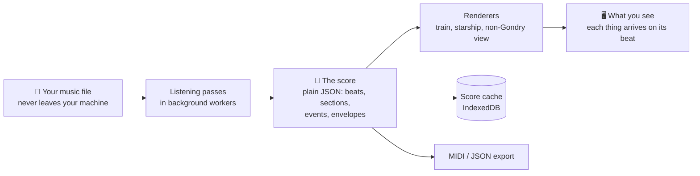
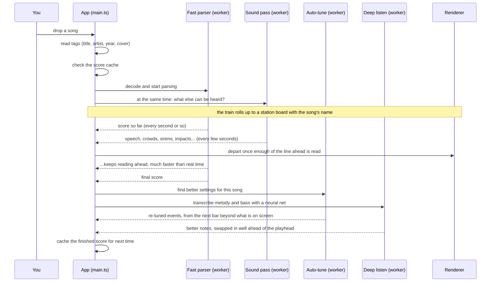
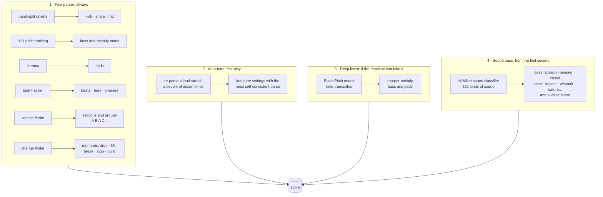
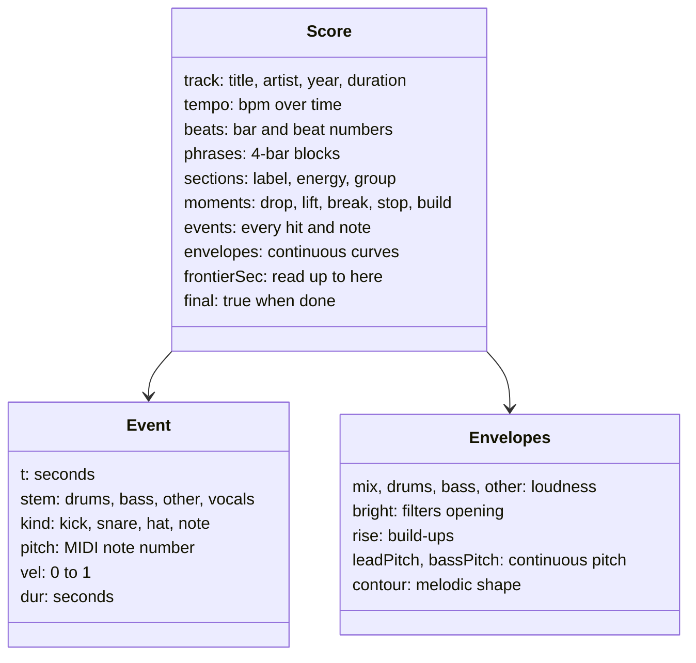
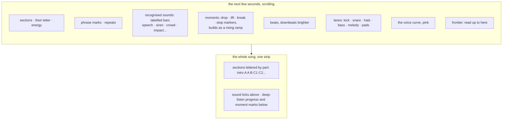
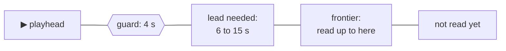
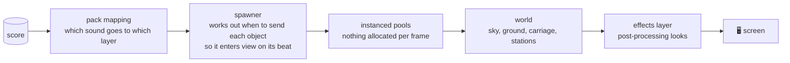
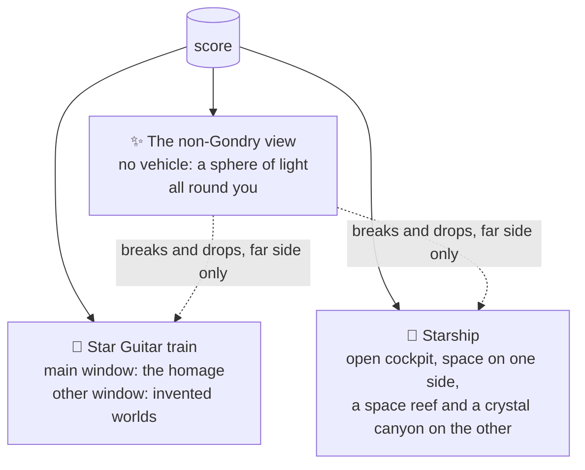

# How the Gondryator works

This is the plain-English tour of the technology: what happens between dropping a song and riding it, which parts do what, and why it is built this way. The diagrams render on GitHub. For setup and commands see [START.md](START.md); for the detailed reference see [BUILD.md](BUILD.md); for the non-Gondry view see [VISUALISER.md](VISUALISER.md).

## The big idea

A normal music visualiser hears the music at the same moment you do, so all it can do is react. The Gondryator **reads the song before it plays it**. It turns the audio into a *score*: a plain list of every kick, snare, hat, bass note, melody note and section, each with a time. The visuals are then *scheduled* from that score, the way a train timetable is, so a pole can be sent down the line early enough to pass the window exactly on the kick.

Everything runs in your browser. Nothing is uploaded and there is no server that hears your music.

## The journey of a song

The station stop at the start is not decoration. It hides the wait while the first stretch of the song is read and the shaders are built. How long the stop lasts is learned per machine (see [Lead time](#lead-time-how-far-ahead-it-reads)).

## The four listening passes

The score is built in layers. Each pass can only make it better, and each one swaps its improvements in *ahead* of the music, never under your feet.

| Pass | Where | Speed | What it adds |
|---|---|---|---|
| **Fast parser** (`src/analysis/analyzer.ts`) | a Web Worker | many times faster than real time | Drums from band-split onsets; bass and lead notes from pitch tracking; pads from chroma; a beat tracker with bars and four-bar phrases; sections, each with a `group` so parts that sound alike share a letter; **moments**, the sudden changes (a drop, a lift, a break, a stop, a build), each on the beat it lands on; envelopes for loudness, brightness, build-ups and continuous pitch. No neural network, so it starts at once on any machine. |
| **Auto-tune** (`src/analysis/autotune.ts`) | its own worker, after the first full parse | in the background | No answer key: it scores parses on what good parses of real music look like (a steady beat, drums on the grid, a plausible number of hits per bar, a melody that moves in steps) and keeps the best settings. They are saved for that song and applied to the rest of the same ride. |
| **Sound pass** (`src/analysis/sounds.ts`) | its own worker, started together with the fast parser | about 50 times faster than real time, after loading a 4 MB model | Google's YAMNet classifier (run by MediaPipe in WebAssembly) says, about once a second, which of 521 kinds of sound it hears. Everything that isn't the music itself is grouped into 13 families (speech, shouting, laughter, singing, crowds, animals, nature, sirens, engines, impacts, whooshes, ticking clocks, beeps) as **sound cues**, plus a **voice** curve (how sure it is that someone is singing or talking). It starts first because intros are full of samples and effects; the departure waits a few seconds for it if it needs to. |
| **Deep listen** (`src/analysis/deep.ts`) | its own worker, after the first full parse | depends on the machine; skipped on phones | Spotify's Basic Pitch model transcribes the notes far more precisely than the fast parser. It runs in windows; each window is spliced in only when it is comfortably ahead of the playhead. |

A **MIDI file** of the same song (drop it with the audio) beats all three for the parts it covers. Its notes replace the parsed ones.

Every setting the fast parser uses can be seen and changed live on the **Tuning screen** (press T), over a piano roll of what it heard.

## The score: the contract between hearing and seeing

Analysis and rendering never talk to each other directly. They only share the score (`src/score/types.ts`). So you can write a whole new ride, or a whole new analyser, without touching the other side.

Two helpers make the grid easy to use: `gridAt(score, t)` says which bar and beat you are in and when the next downbeat and phrase start, and `nextMoment(score, t)` finds the next drop (or any kind of moment), so an effect can wind up and land exactly on it.

One rule makes the whole thing safe: **everything before `frontierSec` is final.** The parser only ever appends, so a renderer can schedule anything up to the frontier knowing it will never change. Later passes respect a margin ahead of the playhead for the same reason.

## Seeing what it heard: the debug overlay

Press **D** (or add `?debug`) and the bottom of the screen shows everything the listeners have found, scrolling past the playhead:

The text lines above it report each pass: the fast parser's speed, the sound pass (`sounds 56× · 12 cues`), deep listen, and, in the non-Gondry view, which elements are on screen, which sounds it is reacting to (`hearing siren, crowd`) and whether the outro has begun.

## Lead time: how far ahead it reads

- Before departing, the score must be read some seconds ahead. That lead is **learned per machine**: the parser's measured speed (remembered between rides) sets it between 6 and 15 seconds.
- If the music ever gets within 4 seconds of the frontier, the train **stops at a signal** until the line ahead is clear. Visuals are never allowed to sync late.
- Each signal stop adds a little to the lead for next time, and each clean ride earns a second of it back.

## Rendering: the timetable

- **Packs** (`src/packs/`) describe a ride entirely as data: its layers (distance from the window, models per theme, how they scale with velocity, pitch or note length), which sounds feed which layer, its colours, light and effects. A new ride is mostly a new pack file.
- **The spawner** (`src/render/spawner.ts`) reads events ahead and places each model so it comes into view, at the leading edge of wherever you are looking, exactly as it sounds. What slides away behind you is what has already played.
- **Models** (`src/render/models.ts`) are all procedural: boxes, cylinders and lathes, painted by one procedural material (`src/render/shaders.ts`) that can be brick, glass, rust or foliage.
- **The effects layer** (`src/render/fx.ts`) is a post-processing pipeline (kaleidoscope, liquid, prism, echo trails, CRT, film, glitch and more) driven by the music: kicks punch, snares split colours, sections change the look.
- **three.js on WebGPU** draws it all, falling back to WebGL2 where WebGPU is missing. Shaders are written in TSL (three's shader language).

## The rides

The train and the starship are scheduled scenery. The non-Gondry view is a different kind of show, a director picking effects for each part of the song. It has its own guide: [VISUALISER.md](VISUALISER.md).

The two shows feed each other. The far window stays the ride (Provence and Cosmos on the train), but on breakdowns and drops **the disco** takes over that whole side: the non-Gondry show's backdrops on the sky and the ground, with the scenery still passing in trippy paint. It never does in the intro or the last stretch (`?side=disco` holds it on). The starship's other side flies through its own invented worlds, a reef adrift in space and a crystal canyon, and the disco takes over there on breaks and drops too. It waits for launch beside a floating screen with a T-minus countdown, and turns up its own rare finds: a derelict, a listening post, a solar sail, a space whale. The main window stays the homage, but now and then it turns up a **rare find**: a windmill, a fairground big wheel, a ruined abbey, an observatory, a glasshouse, a dovecote or a radio mast. These are seeded by the song, so a song always shows its own (`?rare` makes every building one, to look at them). The main window hears the sound pass and the moments too, in ways that stay photographic: animals in the track startle the starlings, an impact or a cheering crowd sends up a firework, and a drop sends up a volley.

## Around the edges

- **Score cache:** finished scores are kept in your browser (IndexedDB), keyed by a hash of the file, so a second ride on a song starts at once.
- **Tags:** title, artist, album, year and cover art are read straight from the file (ID3, Vorbis, MP4) and drive the station boards and the decade closers.
- **Shuffle a folder** plays a folder one song after another, parsing the next while this one plays. **Listen along** rides along to another browser tab, one song behind, so each song is read whole before it plays.
- **Export:** the score downloads as JSON or MIDI. The MIDI file carries a structure track with markers and held notes for sections, phrases, downbeats and moments, so a DAW or another tool can line up with the song's shape.
- **Debug tools:** D (overlay and song-structure strip), T (tuning screen), P (frame analyser), X (force an effects look).

## Why it is built this way

- **Free, private, local.** No accounts, no uploads, no servers. Your music stays on your machine.
- **Data, not code, wherever possible.** The score is plain JSON and the rides are data, so it is easy to remix, and easy for an AI to help you remix.
- **Never late.** A beat that lands late is worse than no visual at all, so the whole design is about reading ahead and scheduling.
