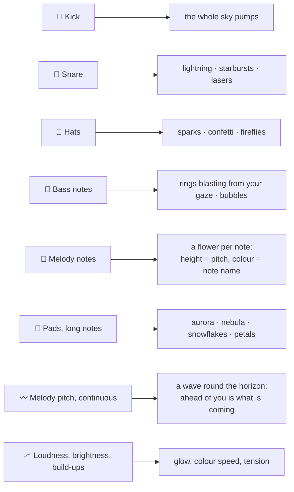
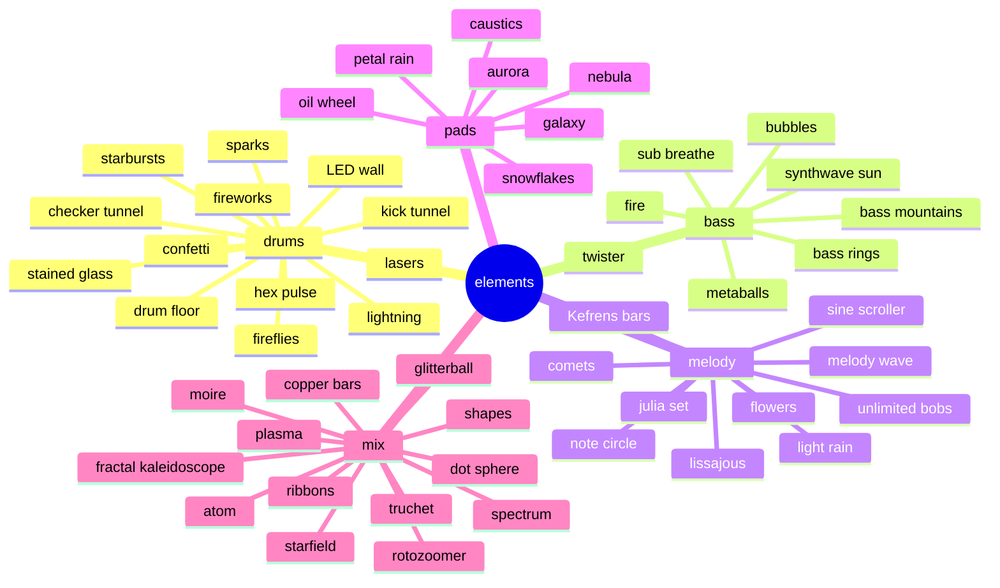
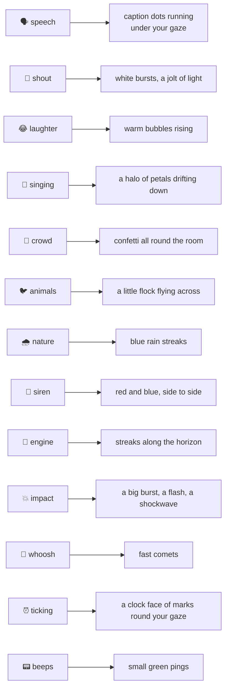
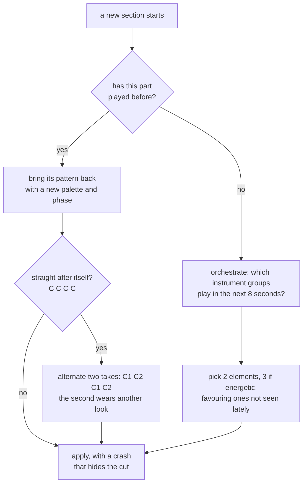
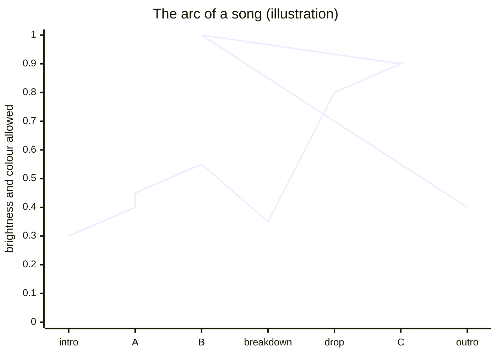
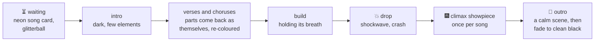

# The non-Gondry view, explained

*"The non-Gondry view :("* is the ride with no vehicle. You sit still at the centre of a sphere of light, and the world around you plays the song. This is a human guide to how it thinks: what it listens to, how it decides what to show, and how a song becomes a journey. For the general architecture see [TECHNOLOGY.md](TECHNOLOGY.md); for the code, `src/render/visualiser.ts` and `src/render/shaders.ts`.

Try it: <https://gondryator.starsystemx.com/?pack=non-gondry>, or `?pack=non-gondry&demo` locally.

## One instrument, one kind of reaction

The first rule is that you should be able to *see* which instrument is which. Each kind of data drives its own kind of thing.

**Notes are things; slides are lines.** A note is an object that appears; a pitch that glides is a line that bends.

## The cast: 51 elements in five groups

Every effect belongs to an instrument group, and only groups that are actually playing get shown.

Over all of that sits a **post-effects look** per scene (clean, echo, liquid, kaleido, fold, tunnel, prism, hyper, trip, thermal, CRT, film, glitch), plus folding mirrors, fractal depth and feedback trails.

## Sounds that aren't the music

A fourth listener, the sound pass, recognises what else is in the track: a sampled voice, a crowd, a siren, an explosion, birds, rain. Each family pops in over whatever scene is showing, shaped like the sound, for as long as it lasts. Intros are full of these, which is why the sound pass starts first.

The debug overlay (D) shows each recognised sound as a labelled bar in the timeline and a coloured tick above the song strip, the voice curve in pink along the bottom, and the moments (drops, lifts, breaks, stops, builds) as markers. Its status line says which sounds the show is reacting to right now (`hearing siren, crowd`). See [TECHNOLOGY.md](TECHNOLOGY.md#seeing-what-it-heard-the-debug-overlay) for the full layout.

## Scenes: who is on stage

A *scene* is a handful of numbers: a palette, two or three elements, a look, kaleidoscope folds, trails. They are drawn from a random generator seeded by the song, so **a song always looks like itself**, and R rerolls it.

Between sections, things keep moving:
- **Twists:** on each new four-bar phrase (once a picture has held for about 6 seconds), and in any case before it has sat still for 14, either one element is swapped for a fresh one, or the scene is re-dressed (palette, mirrors, shapes, look) with a flash.
- **New melody phrases:** when the lead comes back in after a breath, the scene changes.
- **Exhales:** a section clearly quieter than the last thins out to one or two elements with long, slow trails, so the next lift has somewhere to go.

## Reading the song's shape

Because the score is read ahead, the show knows the whole song before it gets there. A classic visualiser can't do this.

- **The arc:** the loudness of the song, smoothed and normalised, sets a ceiling on colour and brightness. The opening stays dark and muted even when loud; full colour is saved for the **climax**.
- **Tension:** in the eight seconds before a lift (a drop or lift the parser marked as a *moment*, the peak of a build, or else a louder section) the show holds its breath. It goes greyer and darker, its trails pull inwards and its clock rushes. Then it lets go on the beat with a shockwave from your gaze.
- **Eras:** stretches whose instrumentation is clearly different (a long intro, a solo, a breakdown with the drums gone) each get a new vibe and one of three **journeys**:
  - **colour rise:** dark and muted to full colour;
  - **complexity bloom:** one element and plain mirrors growing to a deep, crowded kaleidoscope;
  - **thaw:** icy monochrome warming into the palette.
- **Stops:** when the music cuts out for a beat or two, the lights go down with it and snap back on the slam.

## The song's story, start to finish

**The climax showpiece** arrives once, in the section holding the song's peak. It is chosen per song, seeded so a song keeps its own:
- **Timeless set pieces** (galaxy and comets, fractal lightning, Julia set and confetti, fire and flowers, caustics and copper bars) are the most common.
- **Decade closers** are picked by the song's release year: the 50s atom on old film; the 60s oil-wheel light show; the 70s glitterball; the 80s outrun sun or an Amiga megademo; the 90s rave; the 00s fireworks; the 10s main-stage LED wall; the 20s glitch. A song gets its own decade's closer only about one time in four. Any closer can turn up for any song now and then, so a folder of songs from one era doesn't keep repeating.

**The outro** takes the last twelve seconds or so, or the closing outro section. It is a calm scene (stars and the galaxy, aurora and nebula, the oil wheel flickering out on film, sinking under water, the dot globe, or simply the scene as it was). It then fades to black over six seconds. No new sparks are thrown and the trails dry up, so the curtain comes down on a clean screen.

## What to react to, if you build your own

| Data in the score | Feels like | A good reaction |
|---|---|---|
| `kind: 'kick'` | the pulse | something big and global, once per hit |
| `kind: 'snare'` | a crack | a sharp, local strike |
| `kind: 'hat'` | shimmer | many small, short-lived things |
| bass `note` with `pitch`, `dur` | weight | something that radiates or rises from low down |
| melody `note` | the tune | one object per note; height from pitch, colour from note name |
| notes with `dur` ≥ 1.2 s | harmony washes | big, slow blooms |
| `envelopes.leadPitch` | slides and glides | a continuous line that bends |
| `envelopes.mix` and per stem | fullness | glow and density |
| `envelopes.bright` | filters opening | colour speed, sparkle |
| `envelopes.rise` and lifts ahead | tension, release | wind up before, burst on the beat |
| `beats`, `phrases`, `gridAt(score, t)` | the grid | timing anything that should land "on the one"; knowing how far through the bar or phrase you are |
| `moments`: drop, lift, break, stop, build (`nextMoment`) | a slam, the floor falling away, a held breath | wind up before a drop and burst on it; dim with a stop and snap back on the slam |
| `sounds` (speech, crowd, siren, impact...) and `envelopes.voice` | samples and effects | one effect per family, popping in for as long as the sound lasts |
| `sections` with `group` | the story | scene changes; repeated groups come back as themselves |

The data table in [AGENTS.md](../AGENTS.md#build-a-visualiser-reading-the-score) has the full field names and rules of thumb.

## On the rides, out of the other window

The far window of the train and the starship stays recognisably the ride. On a breakdown or a drop (a section, or a break or drop the parser marked), the show's backdrops take over that whole side, sky and ground, while the scenery keeps passing in trippy paint. They never take over in the intro or the last fifteen seconds, so the ride starts and ends as itself. Only the backdrops come along: sprites such as flowers and confetti would hang still while the vehicle travels. Impacts and whooshes flash the whole sky. The main window never sees any of it. Open `?side=disco&demo` and turn round to see it held on.

## Handy switches for trying things

| URL parameter | Does |
|---|---|
| `?pack=non-gondry` | open the non-Gondry view |
| `&demo` | play the generated demo song |
| `&viz=45,32` | pin those elements (indexes from `ELEMENTS` in `visualiser.ts`) |
| `&decade=1980` | pin a decade's closer |
| `&bass=3` | pin a bass style |
| `&fb=0` | turn the feedback trails off |
| `?side=disco` | on the train or starship, hold the far-side takeover on (`?side=provence` or `cosmos` pins a world) |
| `?rare` | on the train, make every building a rare find, to look at them |
| keys **R** · **X** · **D** | new seed · force an effects look · debug overlay with the song's lettered structure |
